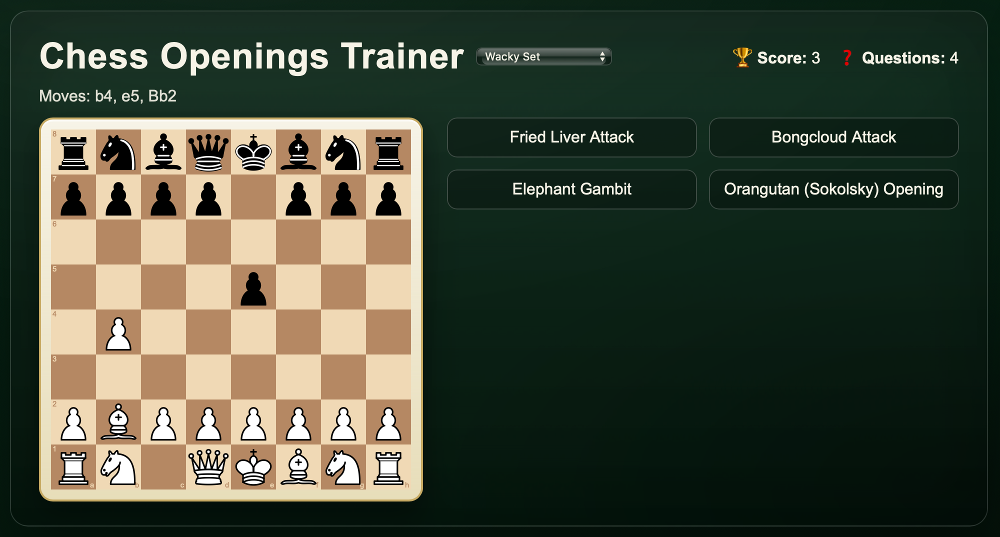

# ChessExplore

> A tiny monorepo for learning and teaching chess openings.  
> The flagship app is an **Opening Trainer** that plays a line on the board (smoothly 🧈)—you guess the name, get instant feedback, and level up your pattern recognition.

<p align="center">
  
</p>

---

## What’s inside

- `chess-openings-app/` – React + Vite web app with an animated board, multiple-choice quiz, scoring, and three curated opening sets.
- `assets/` – screenshots & visuals.

> Built as a hands-on way to practice openings recognition (and to have something more fun than a PDF of lines 😄).

---

## Opening Trainer — highlights

- **Plays the opening**: one move every **2 seconds**, smooth piece animation.
- **Guess the name**: 4 choices; wrong picks turn **red** (disabled); keep trying until you’re right.
- **No spoilers**: the full move list reveals **only after** the animation completes.
- **Correct ⇒ flavor text** (quick description) + **Next** button to load a new puzzle.
- **Scoreboard**, “felt” table theme, responsive layout.

### Sets included

- **Starter (10)** – Ruy Lopez, Sicilian, French, Caro-Kann, Italian, Queen’s Gambit, King’s Indian, English, Nimzo-Indian, Scotch.  
- **Level 2 (16)** – adds **QGD**, **Slav**, **Petroff**, **Berlin**, **London**, **Sicilian Najdorf**, plus Grünfeld, Benoni, Pirc, Dutch, Alekhine, Catalan, King’s Gambit, Evans, Two Knights, Scandinavian.  
- **Wacky (12)** – Bongcloud, Halloween, Stafford, Wayward Queen, Grob, Orangutan (Sokolsky), Danish, Englund, Latvian, Fried Liver, **Elephant**, **Scotch Gambit**.

---

## Quickstart

```bash
# 1) open the app
cd chess-openings-app

# 2) install deps
npm install

# 3) run in dev
npm run dev

# 4) (optional) production build + preview
npm run build
npm run preview
```

If you’re pointing at a backend for openings, set:

```
# chess-openings-app/.env
VITE_API_BASE=http://localhost:5000
```

The app expects endpoints like `/api/openings/<set>` where `<set>` is `starter`, `level2`, or `wacky`.

---

## Tech stack

- **React 18.2 + Vite**
- **react-chessboard 4.x** (board), **chess.js** (rules / SAN→FEN)
- Plain CSS for the “dark green felt” look

> I pinned **React 18.2** with **react-chessboard 4.x** for reliable repaint & animation (I saw flaky updates on React 19 + 5.x).

---

## Project layout

```
chess-openings-app/
  src/
    api/openingsClient.js     # tiny fetch wrapper (supports VITE_API_BASE)
    components/
      ChessBoard.jsx          # computes FEN from SAN; smooth piece animation
      OpeningQuiz.jsx         # quiz state machine: animation, choices, scoring
    hooks/useOpenings.js      # simple fetch + cache
    styles.css                # felt theme + UI polish
    App.jsx, main.jsx
assets/
  sample_openingstrainer.png
```

---

## Design notes & lessons learned

- **Animation model**: render the first `k` SAN moves and let `react-chessboard` animate between positions (don’t remount the board).
- **Timing**: self-scheduling `setTimeout` (more predictable than `setInterval` under dev React) at **2s per move**.
- **UX guardrails**: hide the move list until the animation finishes; wrong answers turn red to give immediate feedback without spoiling future guesses.
- **Compatibility**: React 18 + react-chessboard 4.x gave the smoothest cross-browser results.

---

## Future ideas

- Sound FX + per-move progress ring  
- Difficulty levels or ELO tags per opening  
- “Drill mode” for a single opening from both sides  
- Deploy to Netlify/Vercel (public demo link)

---

## Using AI

This project was built with AI assistance for scaffolding.  
**I designed & implemented** the quiz state machine (timers, one-shot animation), the right-column UX, “wrong turns red” flow, and the compatibility fixes (version pinning + board re-render strategy).

---

## License

MIT — see [`LICENSE`](LICENSE).
